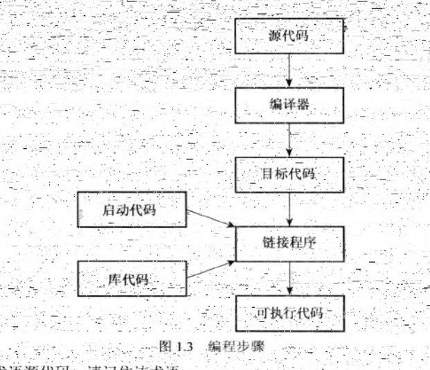
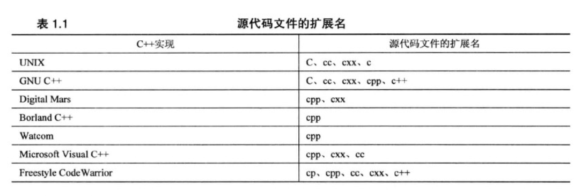
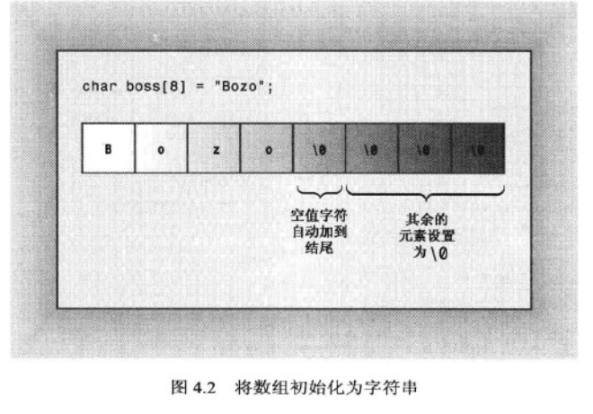
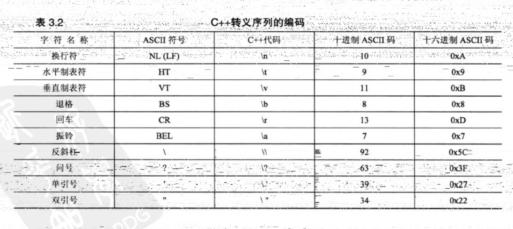
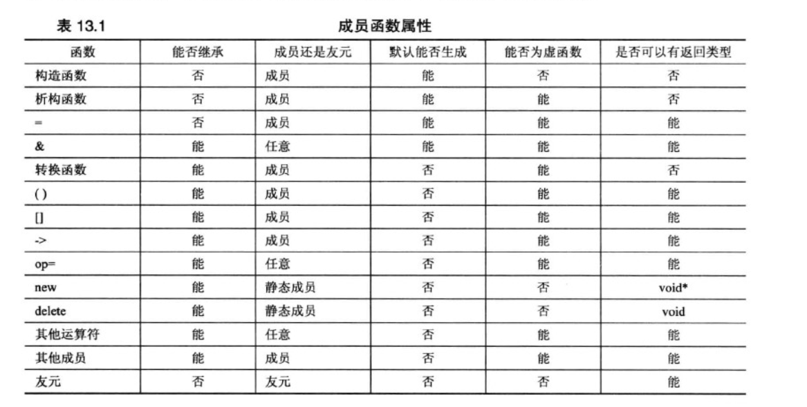

[TOC]
# 第一章 C++基础
    20世纪80年代贝尔实验室开发出了C++。
    c++3种不同的编程方式：C语言代表的过程性语言、C++在C语言基础上添加的类代表的面向对象语言、C++模板支持的泛型编程。
**编程步骤**


**GCC**
* 预处理：gcc -E hello.c -o hello.i
* 编  译：gcc -S hello.i -o hello.s
* 汇  编：gcc -c hello.s -o hello.o
* 链  接：gcc    hello.o -o hello

GCC 设置  环境变量

system函数=CMD命令 


**源代码文件的扩展名**


**定义声明or引用声明**
    是否建立了存储空间
- 定义声明
- 引用声明

**类简介**
     描述数据格式和用法

**C++类型**
C的关键字共有32个
数据类型关键字（12个）
char，short，int，long，float，double，
unsigned，signed，struct，union，enum，void
控制语句关键字（12个）
if，else,switch，case，default
for，do，while，break，continue，goto，return
存储类关键字（5个）
auto，extern，register，static，const
其他关键字（3个）
sizeof，typedef，volatile

* **C++类型**
  * 基本类型
    * 整形
      * char
        * 字母
        * 数字
        * 标点符号 
      * short
      * int
      * long
      * long long 
    * 浮点型
      * float
      * double
      * long double 
  * 复合类型
    * 数组
        *计算数组元素个数*
  `	cout << sizeof things/ sizeof(short) << endl;`
       
    * 字符串
      * char数组初始化位字符串
  
 ~~·char arr[]="S"·~~
      * 字符串输入
        * cin：以空格、制表符、换行符来确定结束的位置
        * cin.getline():以换行符为结尾,将换行符替换为空字符kv
        * cin.get():不丢弃换行符，存入队列
    * 指针
      * 赋值
        * 变量在编译时分配有名称的内存，指针是可以通过名称访问内存提供的别名 (栈存储)
        1、`*pt=&a`
        2、`pt=(int *) 0x21333333`
        * 运行阶段分配未命名的内存用来存储值 （堆或自由存储区）
          * 书写方式
             ``` c++
             int * pt=new int;
             delete pt;
              ```
          * 使用new创建数组
            ``` C++
              int * pt=new int [10];
              delete [] pt;
            ```
          * 将指针当作数组名使用  
                  `pt[i]==*(pt+i)`
                  `&pt[i]==pt+i`
            * 数组名被解释为数组第一个元素的地址，&数组名解释为整个数组的地址
            `short (*pt)[20]=&tell` 
         

    * 结构 
       * 句点成员运算符和箭头成员运算符
            ``` c++
              struct * pt=new struct;
              (*pt).value;
              pt->value;
            ``` 


* **C++管理数据内存方式**
  * 自动存储
    * 常规变量（自动变量）存储在**栈**
    * auto、register
      * auto:指出自动变量为局部的
      * register：建议使用cpu寄存器来存储变量
  * 静态存储（编译器分配固定的内存块存储）
   
    >声明不分配存储空间，引用已有变量，添加关键字extern 
    >volatile:即使代码没有对变量进行修改，其值也可能改变
    >mutable：即使结构变量声明为const类型，其成员也可以改变


       外部 ：代码块外声明
       内部：代码块外声明，添加static
       无链接：代码块内声明，添加static

    ```c++
      //符号名称在C++和C中转换：在函数原型中显式的指出
      extern "c/c++" 函数原型
     ```
  * 动态存储（编译器分配固定的内存块存储）
    new和delete
      * new失败时
        * 早期返回一个空指针
        * 现在引发异常，std::bad alloc
      ```c++
          //new运算符
          int *p1=new int;
          int *p1=new(sizeof(int))
          //定位new运算符
          int buff1;
          int *p2=new (buff1) int;

      ``` 

  * 线程存储（thread_local变量持续性与线程相同）

* 模板
  * vector（动态内存分配）
  `vector<typeName> vt(n_elem);` 
  * array(静态内存分配)
  `array<typeName,n_elem> arr;`
* 前缀
  * 0
  * 0x 
* 后缀
  * ll
  * ull
  * .... 

**字面量计数方式**
  |代号|表示|
  |:----:|:----:|
  |dec |十进制 |
  |hex |十六进制 |
  |oct |八进制 |

**climits的符号常量**

|   符号常量 | 表示  |
|  :----:  | :----:  |
| CHAR_MAX	|char 的最大值
| CHAR_MIN	|char 的最小值
| CHAR_BIT	|char 的位数
| SCHAR_MAX	|signed char 的最大值
| SCHAR_MIN	|signed char 的最小值
| UCHAR_MAX	|unsigned char 的最大值
| SHRT_MAX	|short 的最大值
| SHRT_MIN	|short 的最小值
| USHRT_MAX	|unsigned short 的最大值
| INT_MAX	|int 的最大值
| INT _MIN	|int 的最小值
| UINT_MAX	|unsigned int 的最大值
| LONG_MAX	|long 的最大值
| LONG_MIN	|long 的最小值
| ULONG_MAX	|unsigned long 的最大值
| LLONG_MAX	|long long 的最大值
| LLONG_MIN	|long long 的最小值
| ULLONG_MAX |	unsigned long long 的最大值

**C++转义序列编码**


**CCTYPE**
|函数名称	  | 返回值|
|---|---|
|isalnum(）	|如果参数是字母数字,即字母或数字,该函数返回true|
|isalpha()	|如果参数是字母,该函数返回true|
|iscntrl()	|如果参数是控制字符,该函数返回true|
|isdigit0	  |如果参数是数字(0～9），该函数返回 true|
|isgraph()	|如果参数是除空格之外的打印字符,该函数返回 true|
|islower()	|如果参数是小写字母,该函数返回 true|
|isprint()	|如果参数是打印字符（包括空格）,该函数返回 true|
|ispunct()	|如果参数是标点符号,该函数返回true|
|isspace(）	|如果参数是标准空白字符,如空格、进纸、换行符、回车、水平制表符或者垂直制表符，该函数返回true|
|isupper()	|如果参数是大写字母,该函数返回true|
|isxdigit()	|如果参数是十六进制数字，即0~9、a～f或A～F，该函数返回 true|
|tolower()	|如果参数是大写字符,则返回其小写,否则返回该参数|
|toupperO	  |如果参数是小写字符,则返回其大写,否则返回该参数|

# 第二章 文件输入输出
* C++程序把输入和输出看作字节流
* 缓冲区是用作中介的内存块
  * streambuf类为缓冲区提供内存，并提供了用于填充缓冲区、访问缓冲区内容、刷新缓冲区和管理缓冲区内存的类方法
  * ios_base类表示流的一般特征，如是否可读取、是二进制还是文本流
  * ios类基于ios_base,包括了一个指向streambuf对象的指针成员
  * ostream类从ios类派生，提供输出方法
  * istream类从ios类派生，提供输入方法，8个流对象（4个窄字符流，4个宽字符流）
    * cin
    * cout
    * cerr 没有缓冲
    * clog 被缓冲
    * 对象代表流
  * iostream类是基于istream和ostream的，继承输入方法和输出方法

重定向
* 输入重定向<
* 输出重定向>
## 2.1 文件输入
```c++
#include<fstream>
    ofstream  outfile;//定义文件输出名outfile等同于cout
    outfile.open("carinfo.txt");// 使outfile和文件之间产生联系。
    cout << "Enter the make and model of automobile." << endl;
    //系统会帮忙自动创建一个carinfo.txt的文件。
    outfile << fixed;// 该指令是控制计算机按浮点型进行输出。
    outfile.precision(2);//控制浮点精度为2 。这两段程序简直是装逼利器
    outfile.setf(ios_base::showpoint);
    outfile << "Make and model ." << automobile << endl;
    outfile << "year:" << year << endl;
    outfile << "Was asking $:" << a_price << endl;
    outfile << "Now asking $:" << d_price << endl;
    outfile.close();
```
## 2.2 文件输出
```c++

#include<fstream>


	
	ifstream infile;
	cout << "Enter name of data file: ";
	cin.getline(filename, SIZE);
	infile.open(filename);
	//检查文件是否打开
	if (!infile.is_open()) {
		cout << "Could not open the file" << filename << endl;
		cout << "Program terminating.\n";
		exit(EXIT_FAILURE);
	}
		while (infile.good()) {
        //语句
	}
	if (infile.eof())
		cout << "End of file reached.\n";
	else if (infile.fail())
		cout << "Input terminated by data mismatch.\n";
	else
		cout << "Input terminated for unknow reason.\n";

  //
	if (count == 0)
		cout << "no data processed.\n";
	else {
		cout<<"Items read: "<<count<<endl;
		cout<<"Sum:"<<sum<<endl;
		cout<<"Average:"<<sum/count<<endl;
	}
	infile.close();

```

# 第三章 对象和类
## 3.1 类
  * 类是将数据表示和操作方法整合到一起
  * 在没有创建对象前不分配存储空间
  * 结构是一种其成员在默认情况下为公有的类

* 作用域为类的常量
    * 枚举
    * 关键字static
* 作用域内枚举
  * ```c++
      enum class egg {small,large};
      enum class t_shirt{small};

      egg choice=egg::small;
      t_shirt Floyd=t_shirt::Large;


    ```

 
```c++
      class word{
          private://默认为private


          public:

        //const成员函数：保证函数不修改调用对象
        void show() const;
      }
```

### 3.1.1 构造函数
  >类初始化时，因为数据成员需要隐藏的设计原则，不能直接初始化，需要调用构造函数进行赋值

**构造函数特点**
* 没有返回类型
* 构造函数名与类名相同
* 参数名不能与类成员名相同
  * 可以给类成员添加前缀`m_`或者后缀`_`
* 原型位于类声明的公用部分
* 不能被对象调用
* 编译器提供默认构造函数，没有参数，不能初始化
  * ```c++
      //如果要声明对象，不显示的初始化对象，两种方式解决,只能二选一
      //构造函数提供默认参数
      word(int a=0)
      //函数重载，提供无参数的函数版本
      word(int a);
      word();
    ```

构造函数的调用
```c++
  class word{
          private://默认为private


          public:

      }
//4种对象初始化方式
//显示调用，相当于创建一个临时的对象temp，先调用teamp的构造函数，再将temp赋值给word1，然后执行temp的析构函数。
//因为不同的编译器，在初始化时，不一定创建temp，而赋值语句一定有temp

word word1=word();
//隐式调用
word word2();
//与new一起使用
word *word3=new word();

//列表初始化，与带有默认参数的构造函数匹配

word word3{}；

```
### 3.1.2 析构函数
类word的析构函数`~word()`
**析构函数的特点**
* 没有参数
* 类对象过期时，被自动调用
* 编译器提供默认的析构函数

### 3.1.3 this指针
     指向调用对象的地址

### 3.1.4 友元
* 原型放在类声明中，添加关键字friend
`friend Time operator*(double m,const Time & t)` 
* 定义
`Time operator*(double m,const Time & t){}` 

### 3.1.5 类的自动转换和强制类型转换
**基础：**

### 3.1.6 类和动态内存分配

1. 静态类成员：无论创建多少个对象，只创建一个静态类变量副本
   * 在类声明中声明，在包含类方法的文件中初始化
   * 如果是整形或者const类型，可以在类声明中初始化

### 3.1.7 类继承

**派生类**

* 派生类不能直接访问基类的私有成员，必须通过基类方法访问
* 基类指针或者引用可以不显式的指向或者引用派生类对象
  
```c++
//声明文件
    class newclass:public oldclass
    {
      //根据需要添加数据成员和成员函数

      public:
          //需要添加派生类的构造函数
          newclass();
          

    }
```

```c++
//方法文件
newclass::newclass():oldclass()
{

}
```

**多态公有继承**
* 在派生类中重新定义基类的方法
* 使用虚方法
  * 关键字virtual
  * 基类方法声明中使用关键字virtual可使该方法在基类以及派生类中是虚的
  * 使用指向对象的引用或者指针来调用虚方法，程序使用为对象类型定义的方法（动态/晚期联编）
  * 重新定义基类方法，应声明为虚的
  * 构造函数不能是虚函数
  * 析构函数应当是虚函数，除非类不用做基类
  * 友元不能是虚函数，只有成员函数才能是虚函数

**访问控制：protected**
派生类可以直接访问，其他的不可以直接访问


**抽象基类**

**成员函数属性**



### 3.1.8 包含对象成员的类
#### 3.1.8.1 valarray类
* 处理数值（或者类似特性的类）
* 将数组中所有元素的值相加以及在数组中找出最大和最小的值等操作

```c++
#include<valarray>
//形式
valarray<typename> val_name;
//方法


```
|方法|作用|
|--|--|
|operator[]()|访问各个元素|
|size()|返回包含的元素数|
|sum()|返回所有元素的总和|
|max()|返回最大的元素|
|min()|返回最小的元素|

### 3.1.9 多重继承
必须使用public来限定每一个基类，否则为私有派生
`class newclass:public old1,old2{}`
 
### 3.1.10 类模板
`template <typename Type>`

### 3.1.11 友元类
```c++
//*****************定义文件

class Class_{
  public:
  //友元类声明
  firend class Friend_;
}
//友元成员函数声明顺序
{
    class Tv;//前向声明
    class Remote{};
    class TV{
      friend void Remote::set_chan(Tv&t,int c);
    };
}
//done!

//相互友元
//Remote声明位于Tv之后，volup可以在类中定义，buzz在声明外部定义。
{
  class Tv{
    public: 
    friend class Remote;
   void  buzz();
  }
  class Remote{
    public:
    friend class Tv;
    void Bool volup(){}
  }
  inline void Tv::buzz(){}
}
//done!

//共同友元
{
  class Analyzer;
  class Probe{
    friend void sync();
  }
  class Analyzer{
    firend void sync();
  }

  inline void sync(){}
}
```
### 3.1.12 嵌套类

## 3.2 string类
**string类的构造函数**
|构造函数|描述|
|---|---|
|string(const char * s)|将string对象初始化为s指向的NBTS(null-terminated string 以空字符结束的字符串)|
|string(size_type n,char c)|创建一个包含n个元素的string对象，其中每个元素被初始化为字符c|
|string(const string &str)|将一个string对象初始化为string对象str（复制构造函数）|
|string()|创建一个默认的string对象，长度为零|
|string(const char *s,size_type n)|将string对象初始化为s指向的NBTS的前n个字符，即使超过了NBTS结尾|
|template\<class Iter> string(Iter begin,Iter end)|将string对象初始化为区间[begin,end]内的字符，其中begin，end的行为像指针，用于指定位置，范围包括begin在内，但不包括end|
|string(const string & str,string size_type pos=0,size_type n=npos)|将一个string对象初始化为对象str中从位置pos开始到结尾的字符，或者从位置pos开始的N个字符|
|string(string && str) noexcept|将一个string对象初始化为string对象str，并可能修改str（移动构造函数）|
|string(initializer_list\<char>il)|将一个string对象初始化为初始化列表il中的字符|

```c++
//string类输入
//对于c风格，cin是调用对象，而string对象，cin是参数
//C-风格字符串 3种方式
char info[100];
cin>>info;
cin.getline(info,100);
cin.get(info,100);

//string对象，两种方式
string stuff;
cin>>stuff;
getline(cin,stuff);


//两个版本getline()可选参数，用于指定那个字符来确定输入的边界
cin.getline(info,100,':');
getline(stuff,':');

```
* string对象限制
  * 最大允许长度
  * 程序可以使用的内存量
* string版本getline()函数从输入中读取字符，并将其存储到目标string中
  * 到达文件尾，输入流的eofbit被设置，fail()和eof()都将返回
  * 遇到分界字符（默认为\n），把分界符从输入流中删除，但不存储它
  * 读取的字符到达最大允许值（string::npos和可供分配的内存字节数中较小的一个），设置输入流的failbit，fail()返回true
* 输入流对象中，追踪流的错误状态
  * 检测到文件尾后设置eofbit寄存器
  * 检测到输入错误时设置failbit寄存器
  * 出现无法识别的故障设置badbit寄存器
  * 一切顺利设置goodbit寄存器
  * operator>>()不断读取，遇到空白字符将其留在输入队列，直到遇到分界符并将其丢弃
* rfind()查找子字符串或字符最后一次出现的位置
* find_first_of()在字符串中查找参数中任何一个字符首次出现的位置
* find_last_of()查找最后一次出现的位置
* find_first_not_of()查找第一个不包含在参数的字符


重载的find()方法
|方法原型|描述|
|---|---|
|size_type find(const string &str,size_type pos=0) const|从字符串的pos位置开始，查找子字符串str，如果找到，返回该子字符串首次出现时其首字符的索引：否则，返回string::npos|
|size_type find(const char*s,szie_type pos=0)const|从字符串的pos位置开始，查找子字符串s，如果找到，返回该子字符串首次出现时其首字符的索引：否则，返回string::npos|
|size_type find(const char*s,szie_type pos=0，size_type n)const|从字符串的pos位置开始，查找s的前n个字符组成的子字符串，如果找到，返回该子字符串首次出现时其首字符的索引：否则，返回string::npos|
|size_type find(char ch,szie_type pos=0)const|从字符串的pos位置开始，查找字符ch，如果找到，返回该字串首次出现时其首字符的索引：否则，返回string::npos|

## 3.3 智能指针模板类
* 头文件memory
  * auto_ptr
  * unique_ptr
  * shared_ptr
  * weak_ptr

## 3.4 标准模板库
STL提供了一组表示容器、迭代器、函数对象和算法的模板。是泛型编程（generic programming）
容器：与数组类似的单元，可以存储若干个值。是存储其他对象的对象。被存储的对象类型必须是可复制构造和可赋值的。每个容器都定义了一个合适的迭代器iterator
`vector<double>::iterator pd=scores.begin()`
简化为
`auto pd=scores.begin()`
算法：完成特定的任务的处方
迭代器：遍历容器的对象，是广义指针，也可以是一个可以对其执行类似指针的操作（解除引用、递增）的对象
STL能构造各种容器（包括数组、队列、和链表）和执行各种操作（包括搜索、排序和随机排列）
模板提供了存储在容器中的数据类型的通用表示，迭代器是遍历容器中值的通用表示
STL组件是工具，也是床架其他部件的基本工具
### 3.4.1 迭代器
* 输入迭代器
  * 被程序用来读取容器中的信息
  * 不会修改容器中的值
  * 能访问容器中的值
  * 单向，可以递增，不能倒退
* 输出迭代器
  * 将信息从程序传输给迭代器
  * 对于单通行、只读算法，使用输入迭代器；对于单通行、只写算法，使用输出迭代器
* 正向迭代器
  * 只能使用++运算符来遍历容器
  * 按相同顺序遍历
  * 可以读取和修改数据
  * 也可以只能读取数据
* 双向迭代器
  * 具有正向迭代器的所有特性
  * 同时支持两种（前缀和后缀）递减运算符
* 随机访问迭代器
  * 具有双向迭代器的特性
  * 支持随机访问操作
  * 用于对元素进行排序的关系运算符

**随机访问迭代器操作**
a和b都是迭代器值，n为整数，r为随机迭代器变量或引用


|表达式|描述|
|---|---|
|a+n|指向a所指向的元素后的第n个元素|
|n+a|与a+n相同|
|a-n|指向a所指向的元素前的第n个元素|
|r+=n|等价于r=r+n|
|r-=n|等价于r=r-n|
|a[n]|等价于*(a+n)|
|b-a|结果为这样的n值，即b=a+n|
|a<b|如果b-a>0,则为真|
|a>b|如果b<a,则为真|
|a>-b|如果(a<b),则为真|
|a<=b|如果(a>b),则为真|

**迭代器性能**

|迭代器功能|输入|输出|正向|双向|随机访问|
|---|---|---|---|---|---|
|解除引用读取|有|无|有|有|有|
|解除引用写入|无|有|有|有|有|
|固定和可重复排序|无|无|有|有|有|
|++i i++|有|有|有|有|有|
|--i i--|无|无|无|有|有|
|i[n]|无|无|无|无|有|
|i+n|无|无|无|无|有|
|i-n|无|无|无|无|有|
|i+=n|无|无|无|无|有|
|i-=n|无|无|无|无|有|

* 头文件iterator
  * ostream_iterator
  * istream_iterator
  * reverse_iterator
  * bcak_insert_iterator
  * front_insert_iterator
  * insert_iterator

### 3.4.2 容器
STL具有容器概念和容器类型。概念是具有名称(如容器、序列容器、关联容器等)的通用类别：容
器类型是可用于创建具体容器对象的模板。以前的11个容器类型分别是deque、Iist、queue、.priority_queue、.
stack、vector、map、multimap、set、multiset和bitset(本章不讨论bitset,它是在比特级处理数据的容器)：
C++ll新增了forward list、unordered map、unordered multimap、unordered set和unordered multiset,且
不将bitset视为容器，而将其视为一种独立的类别。
**容器概念：** 描述了所有容器类都通用的元素
**序列：** 可以通过添加要求来改进基本的容器概念。序列是一种重要的改进。
**关联容器：**是对容器概念的另一个改进，提供了对元素的快速访问。STL提供了4种关联容器：sct、multiset、map和multimap。前两种是在头文件set(以前分别为set.h
和multiset.h)中定义的，而后两种是在头文件map(以前分别为map.h和multimap.h)中定义的。基于树结构
**无序关联容器：**基于数据结构哈希表。这旨在提高添加和删除元素的速度以及提高查找算法的效率。有4种无序关联容器，它们是
unordered_set、.unordered_multiset、.unordered_map和unordered_multimap
**容器类型：**deque、C++11新增的forwardlist、list、queue、priority_queue、stack和vector
**一些基本的容器特征**
X表示容器类型，如vector:T表示存储在容器中的对象类型：a和b表示类型为X的值：r表示类型为
X&的值：u表示类型为X的标识符(即如果X表示vector<int>,则u是一个vector-<int>对象)。

|表达式|返回类型|说明|复杂度|
|---|---|---|---|
|X: iterator|指向T的迭代器类型|满足正向迭代器要求的任何迭代器|编译时间|
|X: value_type|T|T的类型|编译时间|
|Xu;| |创建一个名为u的空容器|固定|
|X();| |创建一个匿名的空容器|固定|
|Xu(a);| |调用复制构造函数后u=a|线性|
|Xu=a;| |作用同Xu(a);|线性|
|r=a;|X&|调用赋值运算符后r=a|线性|
|(&a)->~X()|void|对容器中每个元素应用析构函数|线性|
|a.begin()|迭代器|返回指向容器第一个元素的迭代器|固定|
|a.end()|迭代器|返回超尾值迭代器|固定|
|a.size()|无符号整型|返回元素个数，等价于a.end()-a.begin()|固定|
|a.swap(b)|void|交换a和b的内容|固定|
|a==b|可转换为bool|如果a和b的长度相同，且a中每个元素都等于(==为真)b中相应的元素，则为真|线性|
|a!=b|可转换为bool|返回！(a--b)|线性|

**C++11新增的基本容器要求**
rv表示X的非常量右值

|表达式|返回类型|说明|复杂度|
|---|---|---|---|
|Xu(rv);||调用移动构造函数后，u的值与rv的原始值相同|线性|
|Xu=rv;||作用同Xu(rv);||
|a=rv;|X&|调用移动赋值运算符后，u的值与rv的原始值相同|线性|
|a.cbegin()|const iterator|返回指向容器第一个元素的const迭代器|固定|
|a.cend()|const iterator|返回超尾值const迭代器|固定|

**序列的要求**
t表示类型为T的值，n表示整数，p,q,i,j表示迭代器
|表达式|返回类型|说明|
|---|---|---|
|X a(n, t);||声明一个名为a的由n个t值组成的序列|
|X(n,t)||创建一个由n个t值组成的匿名序列|
|X a(i, g);||声明一个名为a的序列，并将其初始化为区间[i,j)的内容|
|X(i,j)||创建一个匿名序列，并将其初始化为区间[i,j)的内容|
|a. insert(p, t)|迭代器|将t插入到p的前面|
|a.insert(p, n, t)|void|将n个t插入到p的前面|
|a.insert(p, i, j)|void|将区间[i,j)中的元素插入到p的前面|
|a.erase(p)|迭代器|删除p指向的元素|
|a.erase(p, q)|迭代器|删除区间[p,q)中的元素|
|a.clear()|void|等价于erase(begin(),end()|

**序列的可选要求**
|表达式|返回类型|含义|容器|
|---|---|---|---|
|a.front()|T&|a.begin()|vector list、 deque|
|a.back()|T&|*--a.end()|vector list、 deque|
|a.push front(t)|void|a.insert(a.begin( ), t)|list、deque|
|a.push back(t)|void|a.insert(a.end(), t)|vector、 list、 deque|
|a.pop_front(t)|void|a.erase(a.begin())|list、deque|
|a.pop_back(t)|void-|a.erase(--a.end())|vector、 list、 deque|
|a[n]|T&|*(a.begin()+'n)|vector、 deque|
|a.at(t)|T&|*(a.begin()+ n)|vector、 deque|
* STL容器的基本方法
  * size()返回容器中的元素数目
  * swap()交换两个容器的内容
  * begin()返回一个指向容器中第一个元素的迭代器
  * end()返回一个表示超过容器尾的迭代器

* vector模板类方法
  * push_back()将元素添加到矢量末尾，它负责内存管理，增加矢量的长度，使之能容纳新的成员
  * erase()方法删除矢量中给定区间的元素，接受两个迭代器参数，第一个迭代器指向区间的起始处，第二个指向位于区间中止处的后一个位置
  * insert()，接受3个迭代器参数，第一个参数指定新的元素的插入位置，第二个第三个迭代器参数定义了被插入的区间，通常是另一个容器对象的一部分
* 非成员函数non-number,适用于所有容器类
  * for_each(),接受3个参数，前两个定义容器中区间的迭代器，最后一个是指向函数的指针（函数对象）
  * Random_shuffle()接受两个指定区间的迭代器参数，并随机排列该区间中的元素。要求容器类允许随机访问
  * sort()函数要求容器类支持随机访问，两个版本
    * 接受两个定义区间的迭代器参数，并使用（为存储在容器中的类型元素定义的）<运算符，对区间中的元素进行操作
    * 接受3个参数，前两个是定义区间的迭代器参数，最后一个是函数对象
  * copy()
  * find()
  * set_union()
  * set_intersection()
  * set_difference()
  * transform()

### 3.4.3 函数对象
**函数符概念：**生成器（generator）、元函数（unary function）、二元函数（binary function）
**改进版本：**返回bool值的一元函数是谓词（predicate）、返回bool值的二元函数是二元谓词（binary predicate）
**运算符和相应的函数符**

|运算符 |相应的函数符|
|---|---|
|+|plus|
|-|minus|
|*|multiplies|
|/|divides|
|%|modulus|
|-|negate|
|==|equal to|
|！=|not equal to|
|>|greater|
|<|less|
|>=|greater equaf|
|<=|less equal|
|&&|logical_and|
||||ogical or|
|!|logicalnot|

上表列出的预定义函数符都是自适应的。实际上STL有5个相关的概念：自适应生成器（adaptable 
generator）、自适应一元函数（adaplable unary funcion）、自适应二元函数（adaplable binary function）、自适
应谓词（adaptable predicate）和自适应二元谓词（adaptable binary predicate）。

### 3.4.4 算法
STL将算法库分成4组
* 非修改式序列操作
* 修改式序列操作
* 排序和相关操作
* 通用数字运算

前3组在头文件algorithm，第4组是专用于数值数据的，位于numeric

### 3.4.5 其他库
* vector
  * 支持面向容器的操作
* valarray
  * 面向数值计算
* array代替内置数组
---
# 第四章 异常
* 异常处理机制
  * 引发异常
    * throw关键字表示引发异常，紧随其后的值（例如字符串或对象）指出异常的特征
  * 使用处理程序捕获异常
    * catch表示捕获异常
    * 括号中的类型声明指出要响应的异常类型
    * 花括号指出要采取的措施
    * catch方法中使用基类对象时，将捕获所有派生类对象，使用虚方法的基类版本
  * 使用try块
  * 关键字noexcept指出函数不会引发关键字
  * 栈解退
    * 对于线性嵌套的函数调用来说，其中一环发生异常，那么程序退回到try代码块，执行catch，而不是继续执行线性嵌套函数的剩余部分
* 异常头文件
  * exception
  * stdexcept
    * 继承自exception
      * logic_error逻辑错误
        * domain_error值域不再（-1，+1）
        * invalid_argument给函数传递意外的值
        * length_error没由足够的空间执行所需的操作
        * out_of_bounds索引错误
      * runtime_error运行期间发生难以预料的错误
        * range_error
        * overflow_error
        * underflow_error
* new与bad_alloc关联
* 异常带来的问题
  * 意外异常
    * unexpected_handler
  * 未捕获异常


    


  


* 头文件cstdlib
  * abort（）
  * exit（）
---
# 第五章 其他
## 5.1 RTTI
* 指针指向哪类对象
* 是否可以安全的将对象的地址赋给特定类型的指针
  * 派生类对象的地址赋值给基类指针
* 支持RTTI的元素
  * dynamic_cast
  * typeid
  * type_info

## 5.2 类型转换运算符
* dynamic_cast
* const_cast
  * const
  * volatile
* static_cast
* reinterpret_cast
---
Q:
* 访问控制规则（私有，保护，公有，友元）
  * 友元函数、成员函数、类的声明位置
---


# 附录
## 1 函数
* 函数原型作用：  
  * 返回值 
  * 参数类型 
  * 参数数目

>函数参数和按值传递实参传递给形参，形参接收的是数据副本，在函数调用时创建，结束时销毁

**函数调用顺序**
>非模板函数->具体化->常规模板函数

**显式具体化声明在关键字template后包含>，而显式实例化没有。**


## 函数与数组

**函数原型**
`int arr_sum(int arr[],int n)`
>数组为实参时，实际是将数组的地址，以按值传递的方式，赋给了函数形参
>在不改变数组内容时，使用const修饰函数。
`ar2[r][c]==*(*(ar2+r)+c)`
```c++
    int sloth=39;
    const int * ps=&sloth;
    int * const finger=&sloth;
//sloth、*finger可改
//*ps不可改，但是可以通过sloth修改
//ps可以指向新的变量，finger不能指向新的变量

```
**函数指针**
`void function(double (*pt)(int))`


## 2 重载限制
1. 重载后的运算符必须至少有一个操作数为用户自定义的类型
2. 运算符不能违反运算符原来的句法规则
3. 不能创建新运算符
4. 不能重载下列运算符
 
|运算符|含义 |
|---|---|
| sizeof|sizeof运算符 | 
|.|成员运算符|
|*|成员指针运算符|
|：：|作用域解析运算符|
|？：|条件运算符|
|typeid|一个RTTI运算符|
|const_cast|强制类型转换运算符|
|dynamic_cast|强制类型转换运算符|
|reinterpret_cast|强制类型转换运算符|
|static_cast|强制类型转换运算符|

---
# 汇总
## 常用代码
常量定义方式
* `const int a=100`
* `#define NUM 100`

冒泡
```c++
for (i = 0; i < n-1; i++)
	{//外循环元素-1
		for (j = 0; j < n - i -1 ; j++)//内循环元素-1-执行次数
		{
      //升序降序
			if (a[j]  > a[j + 1])
			{//交换代码
				tmp = a[j];
				a[j] = a[j+1];
				a[j+1] = tmp;
			}
		}
	}

```
## 错误汇总
scanf安全问题
* `#define _CRT_SECVRE_NO_WARNINGS`
* `#pargma warning(disable:4996)`

## 进制转换
十进制转二进制、八进制、十六进制，除二/八/十六反序取余法
二进制、八进制、十六进制转十进制，权值法

二进制转八进制、十六进制，二进制取3位、4位计算

* 正数 源码=反码=补码
* 负数 （最高位为1）源码（除最高位，其余按位取反）反码（最低位加1，最高位如果溢出，舍弃）补码
* 127+1=-128,127+2=-127
* 补码优势
  * 统一零
  * 减法变加法
  * -128=1000,0000

